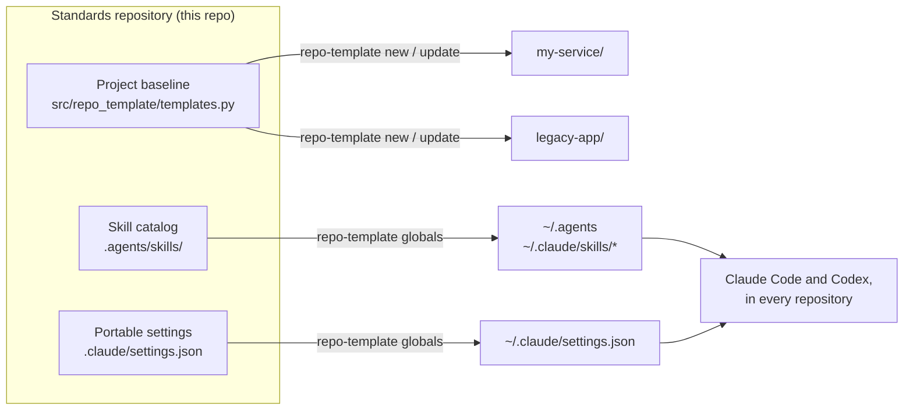
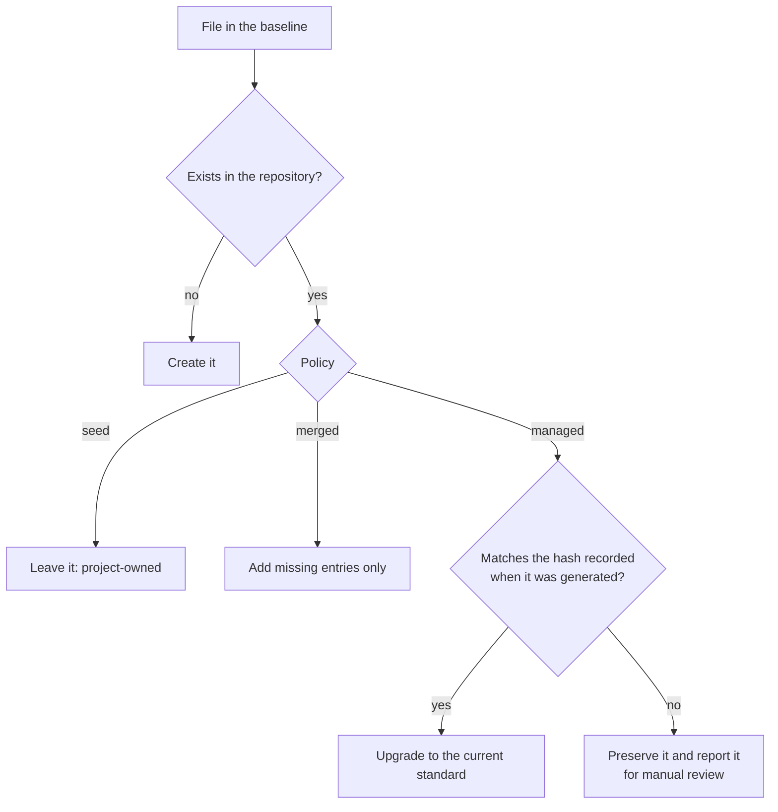
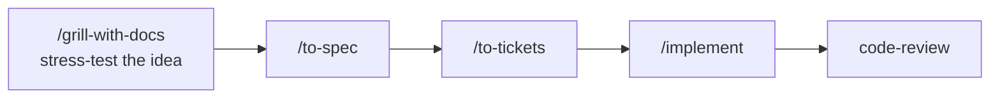

# repo-template

**One standard for every repository you start and every machine you code on, built so AI coding
agents (Claude Code, Codex) find what they need and do their best work.**

`repo-template` is two things that belong together:

1. **A CLI that creates and safely updates Python/uv repositories.** A new repository comes out
   ready to work in: uv, pytest, Ruff, strict mypy, CI, Dependabot, a pre-commit secret scan,
   and the context files agents read first (`AGENTS.md`, `GLOSSARY.md`, `docs/adr/`). Existing
   repositories move toward the same standard without losing local changes.
2. **A versioned catalog of agent skills and settings.** `.agents/skills/` holds the skills you
   rely on: test-driven development, bug diagnosis, architecture review, spec → tickets →
   implementation, code review, LangChain/LangGraph, evals and more. One command links them
   into Claude Code and Codex on any machine.

## Why this exists

AI agents are only as good as the repository they land in and the workflows they're given.

- **Agents need context in predictable places.** An `AGENTS.md` with the real commands and the
  system's purpose and boundaries, a `GLOSSARY.md` of domain terms, and ADRs that explain past
  decisions give an agent the context a new teammate would ask for. Skills such as
  `domain-modeling`, `codebase-design`, `improve-codebase-architecture` and `grill-with-docs`
  read and write exactly these files.
  Every generated repository has them.
- **Agents need a fast, strict feedback loop.** `tdd` and `diagnosing-bugs` work only when tests,
  lint and type checks fail loudly. Every repository gets the same `pytest` / `ruff` /
  `mypy --strict` loop, enforced by a pre-commit hook and CI.
- **Copied templates rot.** Cookiecutter-style templates are copied once and then drift.
  `repo-template update` keeps bringing repositories forward, and because it records what it
  generated, it never overwrites a change you made.
- **Skills drift between machines.** Hand-copying `~/.claude/skills` leaves every laptop slightly
  different. Here the catalog is a Git repository: `git pull && repo-template globals` makes
  machines identical, while credentials, history and caches stay local.

## How it works



### Who owns each generated file

Every file in the project baseline has a policy that decides what `update` may do to it.

| Policy | Files | What `update` does |
| --- | --- | --- |
| **Managed** | CI workflow, Dependabot, PR template, pre-commit hook, `.editorconfig`, `.gitattributes`, `.python-version`, `CLAUDE.md` | Upgrades the file to the current standard **only if** it is unchanged since it was generated. Edited files are left alone and reported. |
| **Seed** | `README.md`, `AGENTS.md`, `GLOSSARY.md`, `CHANGELOG.md`, `.env.example`, issue templates, `docs/adr/README.md`, package `__init__.py`, smoke test | Written once if missing, then the file is yours. Never touched again. |
| **Merged** | `pyproject.toml`, `.gitignore`, `.vscode/*.json` | Adds what is missing and never removes anything: dev dependencies and tool tables in `pyproject.toml`, a marked block in `.gitignore`, missing keys, extension recommendations and tasks in VS Code files. Project metadata and dependencies are not touched. |

Each generated repository commits a `.repo-template.json` manifest that records the template
version, the project variables, and a SHA-256 of every managed file as generated. That hash is
how `update` tells "unchanged since generation, safe to upgrade" from "you edited this, leave it".



Running `update` a second time changes nothing.

### Global linking: portable files only, never machine state

`repo-template globals`:

- links `~/.agents` → `<standards>/.agents` (Codex and the `npx skills` CLI read global skills
  from here);
- links `~/.claude/settings.json` → `<standards>/.claude/settings.json` (model, effort level,
  enabled plugins, deny rules for reading `.env` and key files, and the skill receipt hooks);
- creates one link per skill that isn't in a skill pack,
  `~/.claude/skills/<name>` → `<standards>/.agents/skills/<name>`, and removes links to skills
  that were deleted or moved into a pack;
- keeps this repository's `.claude/skills/` mirror in step with the catalog (relative links, so
  they work on every machine);
- adds `.agents/`, `.claude/` and `.codex/` to your global Git ignore, so personal agent
  configuration never leaks into project repositories.

It never links `~/.claude` itself, so credentials, sessions, history, caches and Claude's
`synced` directory stay on the machine. Anything it replaces is first moved to
`~/.repo-template/backups/<timestamp>/`.

## Quick start

### Install (once per machine)

Keep this repository at a stable path. On a Mac, `/aiDevStandards` is the recommended
location; on the Linux workstation it lives at `/ai/Moore/repo-template`.

```bash
git clone git@github.com:bennwitt/repo-template.git /aiDevStandards
cd /aiDevStandards
uv tool install --editable .
repo-template globals --standards-root /aiDevStandards --check   # preview
repo-template globals --standards-root /aiDevStandards           # apply
```

Because the install is editable, a `git pull` updates the CLI and its templates without a
reinstall. Set `AI_DEV_STANDARDS=/aiDevStandards` in your shell profile to omit
`--standards-root`. A root named either way must be a standards repository, or the command stops
with an error.

### Create a repository

```bash
repo-template new my-service --parent ~/code --description "Processes customer jobs."
cd ~/code/my-service
uv run pytest
```

`new` normalizes the name (`My Service` becomes the project `my-service` with package
`my_service`), refuses to write into a non-empty directory, runs `git init -b main`, points
`core.hooksPath` at `.githooks/`, and creates `uv.lock`. `--python 3.13` changes the Python
version (default `3.12`). Use `--no-git` or `--no-lock` only when another system owns those
steps.

### Bring an existing repository up to standard

```bash
repo-template check  /path/to/repo   # dry run: lists what would change, writes nothing
repo-template update /path/to/repo   # apply
```

For a repository without a manifest, `update` infers the name, description and Python version
from `pyproject.toml`. Files that already exist and differ from the standard are listed under
**Preserved for manual review**. Compare them with a freshly generated repository, merge by
hand, and run `update` again.

Repositories created before 0.2.0 have a `CONTEXT.md`. The engineering skills now read
`GLOSSARY.md`, so `update` lists `CONTEXT.md` for manual review rather than renaming a file you
own: run `git mv CONTEXT.md GLOSSARY.md`, move any Purpose and Boundaries sections into
`AGENTS.md`, and keep only terms in the glossary. `update` also configures the Git hook path (skip with
`--no-hooks`) and creates `uv.lock` when it is missing or refreshes it when `pyproject.toml`
changed (skip with `--no-lock`). `check` plans the same steps, including the hook path and the
lockfile, so a clean `check` means `update` has nothing to do.

### Exit codes

| Command | `0` | `1` | `2` |
| --- | --- | --- | --- |
| `new` | created | created, but a Git or uv step failed | n/a |
| `update` | applied cleanly | a Git or uv step failed | files preserved for manual review |
| `check` | current | something would change | n/a |
| `globals --check` | current | links would change | n/a |

This makes the CLI easy to script, for example `repo-template check . || echo "standards drifted"`.

## What a generated repository contains

```text
my-service/
├── AGENTS.md              # purpose, boundaries, commands and working agreements for any agent
├── CLAUDE.md              # "@AGENTS.md": Claude reads the same guide as Codex
├── GLOSSARY.md            # domain terms only, kept by the domain-modeling skill
├── docs/adr/              # architecture decision records
├── README.md, CHANGELOG.md
├── pyproject.toml         # uv_build, pytest, Ruff, mypy --strict
├── src/my_service/        # __init__.py, py.typed
├── tests/test_smoke.py
├── .githooks/pre-commit   # secret scan, uv lock --check, ruff, mypy, pytest
├── .github/               # CI, Dependabot (uv and Actions), PR and issue templates
├── .vscode/               # interpreter, pytest, Ruff on save, tasks
├── .env.example           # .env, *.pem and *.key are ignored
├── .ai/receipt-policy.json # turns on skill receipts (see below)
└── .repo-template.json    # ownership manifest: commit it
```

## The skill catalog

Skills live in `.agents/skills/<name>/SKILL.md`. `.claude/skills/` in this repository is a mirror
of symlinks, so the same skills appear when you open this repository in Claude Code.

A skill with `disable-model-invocation: true` runs only when you type `/name`, so it costs no
context until you use it. The others are listed in every session so the agent can pick them up
on its own. Claude Code's `/skill-doctor` shows each skill's per-turn context cost and how often
it is used; run it occasionally and prune what you never use.

### Engineering workflow (mattpocock/skills)

A typical feature moves through these skills:



| When you want to… | Use |
| --- | --- |
| Find the right skill or flow | `/ask-matt` |
| Stress-test a plan | `grilling`, `/grill-me`, `/grill-with-docs` (also writes ADRs and glossary terms) |
| Turn a discussion into work | `/to-spec`, `/to-tickets`, `/wayfinder` (work larger than one session) |
| Build | `/implement`, `/implement-spec`, `tdd`, `prototype` |
| Fix a hard bug or regression | `diagnosing-bugs` |
| Improve structure | `/improve-codebase-architecture`, `codebase-design`, `domain-modeling` |
| Review changes | `code-review` (against repository standards and against the spec) |
| Manage issues | `/triage`, `/to-questionnaire` |
| Pause and resume | `/handoff`, `/claude-handoff` |
| Write | `writing-for-agents`, `/writing-fragments`, `/writing-shape`, `/writing-beats` |
| Research, learn, reflect | `research`, `/teach`, `/loop-me`, `/retro` |
| Steps only a human can do | `wizard` |

Run `/setup-matt-pocock-skills` once in each repository. It records where issues are tracked,
the triage label names, and the domain-doc layout in `docs/agents/*.md`, which `to-spec`,
`to-tickets` and `triage` read.

### Other global skills

| Area | Skills | Source |
| --- | --- | --- |
| Agent and Git hygiene | `find-skills`, `git-guardrails-claude-code`, `resolving-merge-conflicts` | vercel-labs/skills, mattpocock/skills |

### Skill packs: domain skills only where they apply

A skill's description is listed in every session, so a LangChain skill costs context in a repository
that has nothing to do with LangChain, and its broad triggers can fire there. Skills that only make
sense in some repositories are grouped into packs in `.agents/skill-packs.json`. `globals` doesn't
link pack skills into `~/.claude/skills`; a repository opts in instead:

```bash
repo-template new my-agent --pack langchain        # start with a pack
repo-template update /path/to/repo --pack gradio   # add one later (also applies the baseline)
```

The pack is recorded under `skill_packs` in `.repo-template.json`, and `update` links each of its
skills into the repository's `.claude/skills/` (ignored by Git) as links to `~/.agents/skills/`.
To drop a pack, remove it from `skill_packs` and run `update`; its links are removed and nothing
else in `.claude/skills/` is touched. On another machine, `update` recreates the links.

| Pack | Skills | Source |
| --- | --- | --- |
| `langchain` | `ecosystem-primer` (start here), `langchain-*`, `langgraph-*`, `deep-agents-*`, `deepagents-*-quickstart`, `managed-deep-agents`, `langsmith-online-eval-engineering` | langchain-ai/langchain-skills |
| `agent-evals` | `eval-engineering` | langchain-ai/langchain-skills |
| `gradio` | `gradio`, `hf-gradio` | gradio-app/gradio |
| `knowledge-graph` | `knowledge-graph-extraction` | local |
| `typescript` | `setup-ts-deep-modules`, `migrate-to-shoehorn` | mattpocock/skills |

Claude Code plugins (skill-creator, GitHub, Playwright, hookify, and others) are enabled through
`.claude/settings.json` rather than vendored here.

### Skill receipts

Every generated repository has `.ai/receipt-policy.json`. It turns on a record of which skills
ran there:

```json
{"mode": "announce", "logPath": ".ai/skill-receipts.jsonl"}
```

The portable Claude settings register `.agents/hooks/skill_receipt.py` for two hook events:
`PostToolUse` on the `Skill` tool (the model or a subagent used a skill) and `UserPromptExpansion`
(you typed `/skill-name`). Each use appends one line to the log:

```json
{"time": "2026-10-01T20:26:36+00:00", "skill": "tdd", "trigger": "user", "source": "userSettings", "session": "…", "args": "add login"}
```

`mode` is `off`, `log` (append only) or `announce` (append and show a one-line notice in the
session). Repositories without a policy file are ignored, the log is ignored by Git, and the hook
always exits cleanly, so it can never block a session. Receipts cover Claude Code only; Codex has
hooks, but no event that reliably identifies a skill.

### Add, update, or remove a skill

Because `~/.agents` points at this repository, the `npx skills` CLI installs global skills
straight into the catalog:

```bash
npx skills find changelog                                    # search https://skills.sh
npx skills add owner/repo --skill some-skill -g -a claude-code codex
repo-template globals            # links it for Claude and adds the repository mirror link
uv run pytest                    # validates every SKILL.md and the mirror
git add .agents/skills/some-skill .claude/skills/some-skill
git commit -m "Add some-skill skill"
```

To change a vendored skill's description or other frontmatter, don't edit its `SKILL.md`:
`npx skills update` would overwrite the edit. Add it to `.agents/skill-overrides.json` with a
`why`, and `repo-template globals` re-applies it after every update (a test fails until it does):

```json
{"langchain-rag": {"why": "Upstream triggers on any RAG work.", "frontmatter": {"description": "…"}}}
```

`npx skills` records each skill's source in `.agents/.skill-lock.json`, which is committed, so
every machine can update from the same sources. On every other machine, run
`git pull && repo-template globals`. To remove a skill, delete its
folder and run `repo-template globals`, which removes the stale links. `npx skills update -g`
refreshes installed skills from their sources. To write a new skill, use the `skill-creator`
plugin, and follow `writing-for-agents`.

## Safety guarantees

- An edited file is never overwritten. It is reported for review and `update` exits with `2`.
- `update` is idempotent: a second run changes nothing.
- `check` and `globals --check` never write.
- Files are written atomically (temporary file, then rename).
- Global files are backed up before being replaced with links.
- `~/.claude` is never linked wholesale; only `settings.json` and individual skills are.
- Generated repositories ignore `.env`, `.env.*`, `*.pem`, `*.key`, `.agents/`, `.claude/` and
  `.codex/`. The pre-commit hook blocks staged private keys and AWS- or OpenAI-style keys.
- The CLI never creates GitHub repositories, pushes commits, or copies secrets.

## Current limitations

- Some skills predate the lock file and have no recorded source, so `npx skills update` skips
  them; reinstall them with `npx skills add` to track them.
- New repositories don't yet include the `docs/agents/*.md` files the engineering skills expect;
  run `/setup-matt-pocock-skills` after `new`.
- Skill packs scope skills for Claude Code only. Codex reads every skill in `~/.agents/skills`,
  so it still sees pack skills everywhere.
- Python/uv is the only project profile.

## Developing this repository

```bash
uv sync --dev
uv run pytest
uv run ruff check .
uv run mypy src
uv run repo-template --help
```

- Template content: `src/repo_template/templates.py`, one `add()` call per file with its policy.
- What each policy may do to a file (managed, seed, merged): `src/repo_template/policies.py`,
  one class per policy behind a single `decide` interface. Applying them to a repository and
  writing the manifest: `src/repo_template/scaffold.py`. Hook path and lockfile, shared by `new`,
  `update` and `check`: `src/repo_template/repository.py`. Global linking:
  `src/repo_template/standards.py`.
- This repository is the first consumer of its own baseline: it commits a `.repo-template.json`
  and `tests/test_baseline_sync.py` fails whenever `repo-template check .` would change anything,
  or the build pins differ. A Dependabot update here therefore fails CI until `templates.py`
  catches up.
- When you change generated content, bump the version in `pyproject.toml` and
  `src/repo_template/__init__.py`, add a `CHANGELOG.md` entry, and add tests for any change to
  rendering, conflict handling or symlink behaviour.
- `GLOSSARY.md` defines the domain terms used here, such as standards repository, project
  baseline, managed file, seed file, portable global, machine state and skill receipt.
